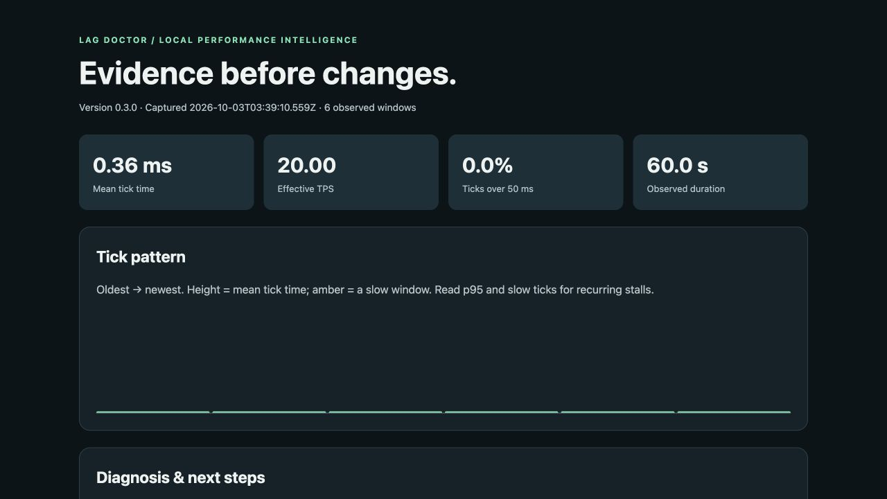

# Lag Doctor

**Change one thing. Check whether your Paper server's tick performance improved.**

Lag Doctor is a free Paper plugin for tick-spike reports, loaded-entity scans and before/after comparisons. It helps you collect evidence during a slowdown and compare fresh measurements after an intervention. Reports stay on your server as readable TXT and offline HTML files.

Created by **William Liu** ([starchlorddotcom](https://github.com/starchlorddotcom)), with substantial AI assistance. MIT licensed. Beta software; no telemetry, accounts, subscriptions or automatic world changes.

## Download

| Your server | Plugin | Java |
|---|---|---|
| Paper 26.3 | [Lag Doctor 0.3.0 Beta on Hangar](https://hangar.papermc.io/starchlorddotcom/LagDoctor/versions/0.3.0) · [GitHub release](https://github.com/starchlorddotcom/LagDoctor/releases/tag/v0.3.0) | 25+ |
| Paper 1.21.11 | [Lag Doctor 0.2.0 Beta](https://github.com/starchlorddotcom/LagDoctor/releases/tag/v0.2.0) | 21+ |

Download the **JAR** for your existing server version; building from source is optional. Spigot, Folia, Bedrock, modpacks and other Minecraft versions are not supported by these releases. The 0.3.0 build was validated on Paper 26.3 beta build 143. Use a test copy first; you do not need to change your world's Minecraft version to try the matching plugin.

## Try it

1. Stop Paper. Remove any older LagDoctor JAR from `plugins/`, put the downloaded JAR there, then restart. Install only one LagDoctor version.
2. Wait about a minute of active server ticks, then run `/ld report` as an operator.
3. Run `/ld export` to save TXT and HTML reports in `plugins/LagDoctor/reports/`.

In the server console, omit the slash: `lagdoctor report` and `lagdoctor export`. Permission: `lagdoctor.admin`, granted to operators by default. `/lagdoctor` and `/ld` are aliases.

**Did the report make your next investigation step clearer?** [Tell me what worked or confused you in the tester thread](https://github.com/starchlorddotcom/LagDoctor/issues/1). Your Paper version, the server activity and a default report export are useful starting points. Review a report before sharing it.

Reports use six windows of 200 ticks by default: approximately a minute at 20 TPS, longer during lag. Empty servers configured to pause will stop collecting ticks while paused.

## Investigate a slowdown

| Command | What you get |
|---|---|
| `/ld report` | Mean and maximum tick time, slow-tick percentage, worst per-window p95, diagnostic clues and next steps |
| `/ld scan` | A bounded sample of already-loaded entity chunks; no new chunks are loaded |
| `/ld scan stop` | Cancel a scan |
| `/ld hotspots` | The last scan, including admin-only world/chunk locations |
| `/ld incidents latest` | Recent slowdown episodes and retained evidence for the latest one |
| `/ld baseline` | Save a complete report in memory before changing one thing |
| `/ld compare` | Compare with a complete set of newer windows; overlapping data is rejected |
| `/ld export` | Save local TXT and HTML reports with locations omitted |

For a comparison, first save `/ld baseline`, change one setting or workload factor, then wait for six complete new windows with the default configuration before running `/ld compare`. Keep players, exploration, farms and other activity as comparable as possible. A lower tick time measures a change; it does not establish what caused it.

Use alongside Paper's bundled spark: `/spark profiler start --timeout 60` captures stacks during the problem. Lag Doctor does not access undocumented spark internals or identify a guilty plugin from counts alone.

## See real output from the local demo



*Actual local demo output after intentional tick delays stopped. These values are not a production benchmark or a claim of automatic lag removal.*

- [Paper 26.3 report showing entity counts, with locations omitted](docs/examples/v0.3/idle-redacted.txt)
- [Paper 26.3 before/after report from an intentional spike demo](docs/examples/v0.3/recovery-redacted.txt)
- [Offline HTML version of that comparison](docs/examples/v0.3/recovery-redacted.html) — download and open locally
- [Run the private demo yourself](docs/LOCAL-DEMO.md)

The synthetic demo intentionally delays ticks, then stops the delay. Complete injected windows showed about 121–122 ms per-window p95 and 10% slow ticks. This verifies detection and comparison behavior; it is not a claim that Lag Doctor automatically removed lag or improved a production server.

## What it can and cannot tell you

Tick duration comes from Paper's tick-end event. A window is slow when its mean exceeds 50 ms or at least 10% of ticks exceed 50 ms. Effective TPS is observed ticks divided by elapsed time, capped at 20. The reported p95 summary is the **worst per-window p95**, not a combined percentile for the entire report.

Heuristics look for GC activity, chunk loading/generation and large loaded entity populations near slow windows. Healthy/slow contrasts help down-rank background activity. These are clues, not proof: entity counts do not measure CPU cost, GC counters do not precisely measure pauses, and a high heap sample does not diagnose a leak. Unexplained slowdowns remain unresolved.

Lag Doctor does not diagnose client FPS, network latency, malicious players, a guilty plugin or hardware faults conclusively. Large-server overhead and real-world cause attribution have not been validated. It does not punish players or change worlds automatically.

## Privacy and retention

Nothing is uploaded by Lag Doctor. Default exports contain counts, times and server version, without player identifiers, world names or coordinates. `/ld export locations` explicitly includes scan locations; admin scan output shows them directly. Spark has its own separate report-sharing behavior.

Exports rotate through ten TXT/HTML pairs; copy reports you want to retain. Baselines are shared across admins and reset on replacement or restart. Incident history also resets on restart. Three consecutive slow windows trigger a console alert with a five-minute cooldown. `config.yml` controls alerts and report length (3–30 windows, default 6); restart after changing it.

## Build and validation

For 0.3.0, use JDK 25 and the included Gradle 9.2.1 wrapper:

```sh
./gradlew test build
```

On Windows, use `gradlew.bat test build`. The JAR is `build/libs/LagDoctor-0.3.0.jar`. The pinned API is `26.3.build.143-beta`; bytecode targets Java 25. The source is browsable in this repository. The matching complete source ZIP is also attached to each GitHub release. Historical release tags and their automatic Source code archives predate the source import; use the named `LagDoctor-0.3.0-source.zip` asset for the exact released package. Original 0.2.0 distribution files remain in the root; use the versioned download links above to install.

**Recorded validation:** all 18 automated tests passed on 2026-10-03. A fresh local Paper 26.3 build 143 server exercised loading, reports, scan counts/cancellation, exports, overlapping-baseline rejection, synthetic spike detection, incident recovery and comparisons. These are functional checks, not a production-scale performance benchmark. [Read the evidence and remaining limits](docs/VALIDATION.md).

The continuous collector uses a fixed 200-value tick buffer and retains at most 30 aggregate windows. It does not iterate entities or profile stack traces. The optional scan separately samples up to 256 already-loaded entity chunks across at most 16 worlds. Exports run asynchronously from immutable snapshots. [Design notes](docs/DESIGN.md) · [0.3 upgrade guide](docs/UPGRADE-0.3.md) · [0.2 investigation guide](docs/UPGRADE-0.2.md).

License: [MIT](LICENSE). Minecraft and Paper are separate projects with their own terms.
